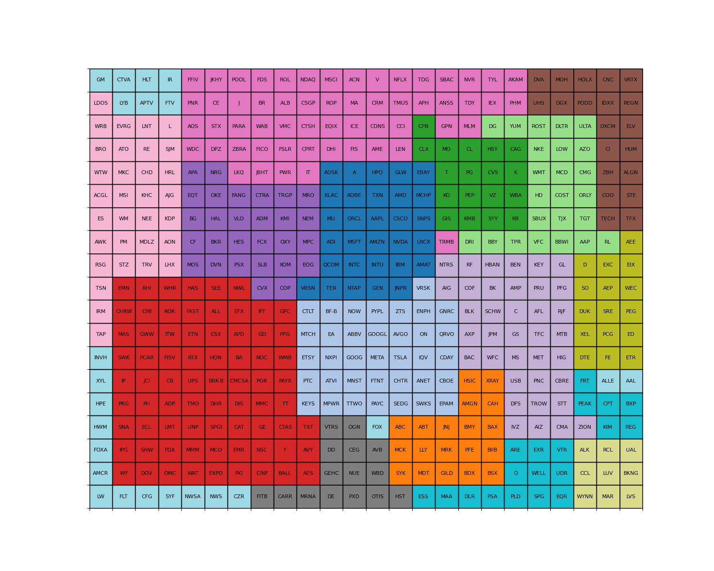

# S&P 500 Simulator with Cellular Automata

> This won't make you the next [Jim Simons](https://en.wikipedia.org/wiki/Jim_Simons_(mathematician))
> but it's a fun way to learn about the stock market and cellular automata.

## What's special?

**Cellular Automata meets Neural Networks**

- Grid placement is calculated analytically by using over 30 years of historical data of the S&P 500
- The grid weights (state transitions) are [LSTM](https://en.wikipedia.org/wiki/Long_short-term_memory) models trained
  on real historical data

## Usage

### Requirements

- [Python 3.10](https://www.python.org/downloads/release/python-3100/)
- [Poetry](https://python-poetry.org/docs/#installation)

### Installation

```bash
poetry install
```

### Downloading Latest Data

Update the `start_date` and `end_date` in `data.py` to the desired date range.
The default is _1st Jan 1990_ to _31st Dec 2022._

**4 Million Data Points** over 33 years for 503 stocks in the S&P 500.

Then run the following command:

```bash
python data.py
```

This will perform the following steps:

1. Get the latest list of stocks in the S&P 500
   from [Wikipedia](https://en.wikipedia.org/wiki/List_of_S%26P_500_companies)
2. Downloads the historical data for each stock from [Stooq](https://stooq.com/db/h/) using `pandas-datareader`
    - Uses multiprocessing to speed up the download but can take ~2-5 minutes
    - Use any applicable data source for `pandas-datareader` by
      updating `data = web.DataReader(ticker, 'stooq', start_date, end_date)` in `get_stock_data()`
    - Saves the data to `data/<TICKER>.parquet`. Uses `parquet` format for faster read/write times.
3. Downloads the latest market capitalization data from [Yahoo Finance](https://finance.yahoo.com/) and saves it
   to `sp500_market_caps.json`

### Generating the grid

To find the optimal grid positions for each stock, run the following command:

```bash
python grid.py
```

This saves the grid positions to `sp500_grid.csv`.

The script performs the following:

1. Load the historical data for all stocks
2. Performs hierarchical clustering on the stocks based on their correlation
3. Creates a force-directed graph to find the optimal grid positions for each stock
4. Performs an evaluation of the grid positions by checking cluster tightness and concentrating larger market cap stocks
   in the center of the grid
5. Repeat steps 3 and 4 for 10000 iterations while evaluating the positions to find the best grid placement

Here is the final grid placement:



_Read more about the background on the grid placement strategy and
demo: [sp500_analysis.ipynb](https://github.com/punitarani/cellular-sp500/blob/master/sp500_analysis.ipynb)._

### Training the Neural Network

To train the LSTM models for grid weights, run the following command:

```bash
python train.py
```

This will train the LSTM models for each neighboring stock pair and save the weights to `weights/<TICKER>.pth`,
the model to `models/<TICKER>.pt` and scalers to `scalers/<TICKER>/.pkl`

> This is a very computationally expensive process.
> It took over 7 hours on a 4 core machine with 16 GB RAM laptop and over 3 hours on a 16 core server instance.
> Currently, the models are trained on CPU only as there are issues training PyTorch LSTM models on GPU.

## Notes

### Using the LSTM Models without the Simulator

The LSTM models can be used without the simulator by using calling the `LSTMModel` class directly.

Using the provided `load_model_and_scaler`, the models and scalers can be loaded from the saved files.

```python
from train import load_model_and_scaler

# Load the trained models and scalers for AAPL and ORCL
model_AAPL, scaler_AAPL = load_model_and_scaler("model_A_AAPL-ORCL")
model_ORCL, scaler_ORCL = load_model_and_scaler("model_B_AAPL-ORCL")
```

Then, we can use the `predict` method to make predictions for a given input sequence.
The input sequence should be a `numpy` array of shape `(5, 1)` because the models were trained on 5 day sequences.

```python
import numpy as np

# Example input sequences for AAPL and ORCL
input_seq_AAPL = np.array([[0.02], [-0.01], [0.03], [0.01], [-0.02]])
input_seq_ORCL = np.array([[0.01], [-0.02], [0.03], [0.02], [-0.01]])

# Make predictions
prediction_AAPL = model_AAPL.predict(scaler_AAPL, input_seq_AAPL)
prediction_ORCL = model_ORCL.predict(scaler_ORCL, input_seq_ORCL)

print(f"AAPL Prediction: {prediction_AAPL:.4f}")
print(f"ORCL Prediction: {prediction_ORCL:.4f}")

AAPL
Prediction: 0.2618
ORCL
Prediction: -0.0041
```
